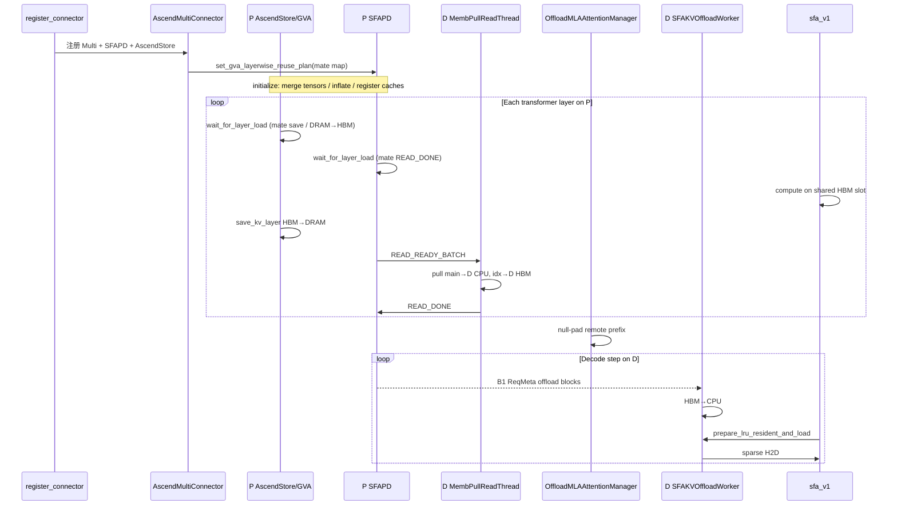

# SFA PD 分离 KV Offload 修改方案

> 分支：`feat/sfa-offload-rebase-on-main`（最新 `d5cfdb8`）  
> 场景范围：**仅 Prefill / Decode 分离**；部署形态固定为 `MultiConnector(SFAPD + AscendStore GVA)`（不讲混部、不讲单独 connector 部署）  
> 目标：支持 GLM5.2 等 Sparse MLA 模型的超长序列（如 1M）推理  
> 整理依据：仓库内代码逻辑与注释（不以外部 C8 文档为准）

---

## 目录

1. 方案总览  
2. 按模块拆解（含 [§2.6 P 节点层间复用](#26-p-节点层间复用方案gva--num_shared_buffers--kv_poolascend_store)）  
3. **[使用流程：对照代码](#3-使用流程对照代码把修改点串起来)**（含文件行数清单 + 功能点→函数行号链接）  
4. 修改点速查  
5. 能力边界  
6. 部署心智模型  

---

## 1. 方案总览

### 1.1 要解决什么问题

PD 分离下，Decode（D）节点需要长期持有 Prefill（P）产生的超长 KV。若把 1M 级 **main MLA K/V** 全部常驻 HBM，NPU 显存不够。

Sparse Attention（SFA / DSA）天然适合做分层存储：

| 部件 | 体积 | 访问模式 | 落点（D 侧） |
|------|------|----------|--------------|
| Indexer K（及 LIC8 scale） | 相对小 | 每步都参与 top-K 选块 | **常驻 HBM** |
| Main MLA K/V（满块） | 大（1M 主体） | 每步只访问 top-K 段 | **CPU DRAM 池** |
| Main MLA 尾部不满块 | 1 个 block | decode 持续写入 | **暂留 HBM**，写满后再卸到 CPU |
| LRU Resident K/V | 固定容量（如 topk=2048） | 本步 sparse attn 的工作集 | **HBM 工作区** |

核心策略一句话：

> **本方案默认 PD 分离：`MultiConnector = SFAPDCpuOffloadConnector + AscendStoreConnector(memcache layerwise)`。P 不开 `use_offload`，用 GVA 做多层 HBM 复用与按层 HBM↔DRAM，并用 SFAPD 按层把 KV 交给 D；D 打开 `use_offload`，main 满块进 CPU、indexer 留 NPU，decode 用 indexer 选 top-K 后再稀疏回灌 resident。**

### 1.2 PD 不对称约定（启动硬约束）

`SFAPDCpuOffloadConnector` 在构造时断言：

| 角色 | `kv_role` | `additional_config.use_offload` | KV 形态 |
|------|-----------|----------------------------------|---------|
| Prefill（P） | `kv_producer` | **`false`** | 标准 paged HBM（**不是** 5/6-tuple 本机 DRAM offload） |
| Decode（D） | `kv_consumer` | **`true`** | Offload 5/6-tuple + CPU 池 + LRU |

重要澄清：**P 不开 `use_offload` ≠ P 没有「offload/交出」行为。**

这里要把两个容易混在一起的概念拆开：

| 概念 | 开关 / 入口 | 作用侧 | 粒度 | 做什么 |
|------|-------------|--------|------|--------|
| **本机 DRAM Offload**（5/6-tuple + CPU 池 + LRU） | `use_offload=true` | **仅 D** | 满 **block** 卸到 CPU；attn 时按 top-K token 回灌 | 解决 D 长驻 1M |
| **按层 KV 交出 / Layerwise Transfer** | `kv_connector_extra_config.use_layerwise`（默认 **true**） | **P 为主**（D 按层收） | **按 transformer layer** | 每层写完 KV 就通知 D pull；不是等整模算完再整包传 |
| **层间 HBM 复用 + HBM↔DRAM**（GVA/memcache） | AscendStore + `layerwise_num_shared_buffers` | **P 为主**（mate 门控也挂到 SFAPD） | N 层时分复用 M 块 HBM；按层 save/load | 算完 **HBM→DRAM**；复用层进场前按需 **DRAM→HBM**，并等 mate save + PD READ_DONE |

所以口语里说「P 侧有 offload」时，通常同时指两件事：

1. **按层交接（SFAPD）**：每层写完就 `READ_READY`，让 D pull  
2. **多层 HBM 复用 + HBM↔DRAM（AscendStore GVA/memcache）**：N 层只占 M 块 HBM，算完的层 **HBM→DRAM**，复用层进场前按需 **DRAM→HBM**，并按层调度状态做门控  

后者不是「顺带注释」，而是 GLM5.2 1M 在 **P 上省显存** 的主手段；前者解决「按层交给 D」。本方案二者通过 **`MultiConnector(SFAPD + AscendStore)` 固定一起开**，不讨论其它单独部署形态。

当前 PD 拉通路径要求：

- `kv_connector`： **`MultiConnector`**，子项包含 `SFAPDCpuOffloadConnector` + `AscendStoreConnector`
- P：`kv_role=kv_producer`，`use_offload=false`
- D：`kv_role=kv_consumer`，`use_offload=true`
- SFAPD：`transfer_backend=memfabric`（P↔D pull）
- AscendStore（挂在 **P**）：`backend=memcache` + `use_layerwise=true` + `layerwise_num_shared_buffers=M`
- D 侧 `DCP * PCP == 1`

### 1.3 组件分工（仅 PD 分离）

```text
MultiConnector（本方案唯一目标部署）
├── SFAPDCpuOffloadConnector          ← P↔D 按层 pull（memfabric）
│     P: use_offload=false；层后 READ_READY；mate=READ_DONE 门控
│     D: use_offload=true；main→CPU / indexer→HBM；组合 SFAKVOffloadWorker
│
└── AscendStoreConnector (memcache)   ← 挂在 P：多层 HBM 复用 + HBM↔DRAM(GVA)
      N 层 merge 成 M 个 HBM buffer（model_runner）
      层后 save：HBM → GVA/DRAM（COPY_L2G）——GVA save 线程：kv_producer
      层前 load：GVA/DRAM → HBM（COPY_G2L，跨 chunk / 共享槽需要时）
      prefetch_layer_map：复用层 → mate 层
      AscendMultiConnector 把 mate map 装到 SFAPD P
```

D 的 HBM 策略只走 `use_offload`（indexer + resident + 少量 tail），**不**使用 AscendStore 的 N 层共享 M 槽。

---

## 2. 按模块拆解：改了什么、为什么

### 2.1 PD Connector 门面 —— `sfa_pd_cpu_offload/`（含 P 侧按层交出）

**入口文件**：`connector.py` / `scheduler.py` / `worker.py` / `protocol.py` / `send_thread.py` / `read_thread.py`

**为什么要有这一层**

vLLM 的 KV connector 只有 SCHEDULER / WORKER × producer / consumer 四个角色位。PD 的控制面（metaserver 会合、谁先起、ZMQ）与数据面（memfabric pull、落点分流）都必须落在 connector 里，不能塞进 attention。

**四象限职责**

| | SCHEDULER | WORKER |
|--|-----------|--------|
| **P** | `SFAPDProducerScheduler`：跟踪 `do_remote_decode` 的本地 block / token / chunk | `SFAPDCpuOffloadProducerWorker`：注册标准 HBM；**按层** `save_kv_layer` → 发 `READ_READY`；**不 push** |
| **D** | `SFAPDCpuOffloadScheduler`：indexer HBM + main CPU（+ partial）；组装 `ReqMeta` | `SFAPDCpuOffloadConsumerWorker`：按层 pull + 组合 `SFAKVOffloadWorker` |

#### P 侧「offload」究竟按什么粒度

P **没有** `use_offload` 的 CPU DRAM 池，但仍有完整的 **layerwise 交出管线**（默认 `use_layerwise=true`）：

```text
每层 SFA/MLA forward 写完 KV
  → maybe_save_kv_layer_to_connector(layer_name, kv_cache)   # attention/utils.py
  → SFAPDCpuOffloadConnector.save_kv_layer
  → SFAPDCpuOffloadProducerWorker.save_kv_layer
       · current_layer 自增（每 step 在 start_load_kv 归零）
       · record NPU event，等本层 KV scatter 写完
       · 组装 SendTask（本层 layer_idx / layer_name + 各 req local_block_ids）
       · 入队 MembPullSendingThread
  → MembPullSendingThread
       · 首包 MF_META（P session + 各层基址 / block_len）
       · 之后每层发 READ_READY_BATCH
       · 收 READ_DONE/FAILED → 置 layer_send_done_events[layer]
```

| 问题 | 答案 |
|------|------|
| 按层还是按别的？ | **按 transformer layer（层）** |
| P 会不会进 `use_offload` CPU 池？ | **不会**（`use_offload=false`） |
| P 会不会 HBM↔DRAM？ | **会**：P 上 AscendStore memcache `COPY_L2G` / `COPY_G2L`，与 SFAPD 的 READY 是两条通道 |
| 「offload」在 P 上指什么？ | ① 按层 `READ_READY` 交给 D；② GVA 多层复用下按层把 KV 从共享 HBM 卸到 DRAM，让后续层复用同一槽 |
| 和 D 的 block offload 区别？ | D：满 **block** → D CPU 池 + LRU；P：满 **layer** →（GVA）DRAM +（SFAPD）通知 D pull |

下一层进 attention 前，SFAPD `wait_for_layer_load` 会等 **mate 层** 的 `READ_DONE`（与 AscendStore 的 mate save 门控叠加）。P 节点复用的完整方案见 **§2.6**。

**Pull 而不是 Push 的原因**

- D 自己知道落点（main → CPU，indexer / partial → HBM）。
- P 只发控制面，D 用 `batch_transfer_sync_read` 主动读。
- 与按层交出配合：P 算完一层，D 就能拉一层，P/D 流水重叠。

**线协议（`protocol.py`）**

- `MF_META`：一次会话交换 P session / 地址
- `READ_READY_BATCH`：**某一层** KV 已写完，可拉
- `READ_DONE` / `READ_FAILED`：该层拉完；P 复用共享 HBM 槽前必须看到 mate 层 DONE

---

### 2.2 D 侧本地 Offload 引擎 —— `sfa_kv_offload/`

**入口文件**：`sfa_kv_offload_worker.py` / `config_data.py` / `kv_transfer.py` / `cpu_sparse_attn.cpp` / `offload_kv_cache_layout.py`

**为什么 PD 还要复用这一套**

PD 的「首次 prompt KV」走 memfabric；但 **decode 期间新产生的满块**仍要从 D 的 HBM 卸到 CPU，并且每步都要从 CPU 稀疏回灌。这两件事与「本机 offload」同构，因此 D consumer worker **组合** `SFAKVOffloadWorker`，避免重写 CPU 池 / LRU / 异步 HBM→CPU。

**KV tuple 槽位（`offload_kv_cache_layout.py`）**

```text
非 C8（5-tuple）:
  [0] MAIN_K   [1] MAIN_V   [2] INDEXER_K   [3] RESIDENT_K   [4] RESIDENT_V

LIC8（6-tuple）: 在末尾追加
  [5] INDEXER_S（scale）
```

**Worker 做什么**

1. 分配 pinned CPU `k/v_caches_cpu`，注册给 memfabric / 拷贝路径  
2. decode 满块：`process_layer_data` → 发送线程异步 HBM→CPU  
3. attention 前：`prepare_lru_resident_and_load`（C++ LRU compact + `offload.sparse_copy`）把 miss token 拉进 resident

**当前实现假设（读代码时要注意的硬编码）**

- DRAM 池容量、CPU block 倍数、main K/V latent 维（如 512/64 bf16）存在代码内常量或 TODO  
- 设计文档 / 部署时需与真实模型、机器内存对齐，不可当通用配置已完备

---

### 2.3 KV Spec / Manager —— `core/kv_cache_interface.py` + `single_type_kv_cache_manager.py`

**改动要点**

- 新增 `OffloadMLAAttentionSpec`：D（`kv_consumer`）的 `max_memory_usage_bytes` **按「每请求约 2 个 resident block」估算**，而不是按 `max_model_len` 估满表  
- 新增 `OffloadMLAAttentionManager`：remote prefill 前缀 **null-pad**（不占真实 HBM block）；decode 块写满并 offload 后 **原地换成 null_block 再还池**（不 `pop`，保持行长与 mask 对齐）

**为什么必须改**

若仍用标准 FullAttention Manager：

1. 启动 must-fit / `max_model_len` 检查会按 1M 全在 HBM 估算 → 假 OOM 或拒绝长上下文  
2. scheduler 会给整个 prompt 前缀 `get_new_blocks` → D HBM 立刻被打爆  
3. block table 长度 / 游标若乱改，attention 侧的 `num_offloaded_blocks` mask 会对不齐，读到错误物理块

**关键不变量（整条链路必须同时满足）**

```text
prompt_len // main_block_size
  == Manager null-pad 宽度
  == Scheduler tracker.num_full
  == Attention metadata.num_offloaded_blocks
```

---

### 2.4 Attention / DeviceOp —— `attention/sfa_v1.py` + `device/device_op.py` + `attention/utils.py`

**改动要点**

- `use_offload` 路径使用 5/6-tuple，独立 indexer `block_table` / `slot_mapping`  
- metadata 增加 `num_offloaded_blocks`：前缀逻辑块视为「已在 CPU」，kernel / host 侧不要当 HBM 有效块  
- decode：indexer 选出 top-K → `prepare_lru_resident_and_load` → NPU-hit 与 CPU-hit 两路 sparse FA，再用 `npu_attention_update` 融合  
- `device_op` 的 indexer select：offload 时 cache 下标改走 tuple 槽位（indexer=2，scale=5），`block_table` 参数化  
- `attention/utils.py`：duck-type 钩子（LRU prepare、num_cpu_blocks、layer send wait 等），避免 attention 强依赖具体 connector 类型

**为什么**

Sparse 选块仍依赖 HBM 上的 indexer；main 内容大部分却在 CPU。若不在 metadata / device_op / sfa_v1 打通「mask + LRU + 双路 FA」，要么错误访问空 HBM，要么每步全量 H2D。

---

### 2.5 Model Runner / Worker —— `worker/model_runner_v1.py` (+ 可选 `worker.py`)

**`model_runner_v1.py`（PD offload 必需）**

- `_get_kv_cache_spec`：`use_offload` 时 main → `OffloadMLAAttentionSpec`，indexer → offload indexer spec；**为每层（含 MTP draft）补齐 indexer 模块**，否则 D 拉不全 / draft 缺表  
- `_allocate_kv_cache_tensors` / reshape：按 5/6-tuple 与 LRU capacity 分配  
- `_build_attention_metadata`：填 `num_offloaded_blocks`、indexer tables、`token_to_req`（MTP token 映射回 request）  
- CPU 块数优先问 connector `get_num_cpu_blocks`（远程前缀真实占用）

**`worker.py`（P 侧 GVA 必需）**

- `determine_available_memory`：GVA layerwise 开启时把 available **乘** `actual_layers / num_buffers`，让 vLLM 算出更多 `num_blocks`（物理仍只分配 M 份共享 tensor）

另见 §2.6：`model_runner._merge_kv_cache_tensors_for_layer_reuse` 把 N 层 tensor merge 成共享槽。

---

### 2.6 P 节点层间复用方案（GVA + `num_shared_buffers`）—— `kv_pool/ascend_store/`

> 本节是 **P 侧省显存本体** 的完整方案说明。  
> 入口：`layerwise_config.py` / `pool_worker.py` / `kv_transfer.py` / `backend/memcache_backend.py` / `ascend_multi_connector.py` / `model_runner_v1._merge_kv_cache_tensors_for_layer_reuse` / `worker.determine_available_memory`

#### 2.6.1 要解决什么问题

Prefill 若为每一层各分配一整块 HBM KV，长序列（甚至中等长度）时 **层数 × 序列长度** 会把 NPU 打爆。  
P 又不走 D 的 `use_offload` 5-tuple，因此用另一条路径：

> **只在 HBM 上保留少量「共享槽」+ 若干独立槽；算完一层就把该层 KV 卸到 memcache/DRAM；后面的层轮流占用同一块 HBM。**

这就是「层间复用 / layerwise reuse」。

#### 2.6.2 名词：GVA、`num_shared_buffers`、independent / mate

**GVA（Global Virtual Address）**

- 来自 **memcache / memfabric_hybrid** 后端。
- 含义：KV 页登记进 memcache 池后，在池侧可寻址的 **全局虚拟地址句柄**。
- 代码侧常与本地 block id 成对出现：`block_ids`（HBM 页）+ `block_gvas`（池侧地址）。
- 拷贝方向（`MmcDirect`）：
  - `COPY_L2G`：Local(HBM) → Global(GVA/DRAM) —— **save / 卸盘**
  - `COPY_G2L`：Global → Local —— **load / 回灌**
- 代码里说的 **「GVA layerwise」** 专指：

```text
backend=memcache 且  use_layerwise=true
（get_gva_layerwise_config 只认这条组合）
```

**`layerwise_num_shared_buffers`（简称 M / `num_shared_buffers`）**

- 配置项：`kv_connector_extra_config.layerwise_num_shared_buffers`
- 含义：**参与复用的层，在 HBM 上有多少块物理 KV buffer 可供时分复用**。
- 不是「总共只有 M 层」，而是「可复用层共享这 M 个槽」。
- 未配置时默认 `= num_layers`（等于不复用）。
- 触发真正复用的条件：`has_layer_reuse = (可复用层数 > M)`；代码里 `layerwise_offload ≡ has_layer_reuse`。

**Independent layers（独立层）**

- 配置：`layerwise_independent_layers`（默认 `[0, num_layers-1]`，即首尾）。
- 每层 **独占一块 HBM**，不参与 M 槽轮转；其 HBM 内容在本层看来更「可信」。
- 其余层进入 `reused_layers`，按 round-robin 分到 M 个共享槽。

**Mate（配对层）与 `prefetch_layer_map`**

- `prefetch_layer_map[L] = mate`：层 L 将占用的共享槽，其 **上一任占用人** 是 mate。
- 通常 mate ≈「同槽、往前数 M 个可复用层」：`reused_layers[k]` 与 `reused_layers[k+M]` 同槽。
- 层 L 进入前必须等 mate：**save 完成**（本机已卸到 DRAM），并且等 mate 的 **READ_DONE**（D 已从旧槽 HBM pull 走）——后者由 SFAPD 承接。

**`layerwise_prefetch_layers`**

- 层前可提前提交多少路 load；默认与 M 相关并有上限，用于与 compute 重叠。

#### 2.6.3 物理布局：N 层如何变成「独立槽 + M 共享槽」

`get_layerwise_storage_indices` / `_merge_kv_cache_tensors_for_layer_reuse`：

```text
例：N=6 层，M=2，independent=[0,5]

独立槽:  [0]     [5]
共享槽A: [1, 3]      ← layer1 与 layer3 时分复用同一块 HBM
共享槽B: [2, 4]      ← layer2 与 layer4 时分复用另一块 HBM

物理 KV tensor 数 = 2（独立）+ 2（共享）= 4
而不是 6
mate 例: layer3→layer1，layer4→layer2
```

Worker 侧 **memory inflation**：`available *= actual_layers / num_buffers`，让 vLLM 在「物理只分配少量 tensor」时仍按长序列算出足够的 `num_blocks`。

`AscendMultiConnector._configure_gva_layerwise_reuse` 把 `prefetch_layer_map` 注入 SFAPD P 的 `set_gva_layerwise_reuse_plan`。

约束：

- GVA layerwise **暂不支持 hybrid 多 KV cache group**（indexer+main 两组会 `NotImplementedError`，需统一 group / 布局一致）。
- MTP 额外层会计入 `actual_layers` 再 merge，否则可能跳过 merge → OOM。

#### 2.6.4 运行时：每一层的调度状态机

对每个 transformer layer：

| 阶段 | AscendStore（P） | SFAPD（P） |
|------|------------------|-------------|
| **层前** | `wait_for_layer_load`：有 `LoadSpec` 则 **DRAM→HBM**；复用层还要等 mate **save_done** | `wait_for_layer_load`：等 mate **READ_DONE** 才允许盖槽 |
| **层内** | Attention 读写 **当前占用的那一块** HBM（标准 paged 布局，不是 5-tuple） | — |
| **层后** | `save_kv_layer`：**HBM→DRAM**（`COPY_L2G`），按 chunk 增量区间 put | `save_kv_layer`：发本层 `READ_READY_BATCH` |

负载起点（`get_layer_load_start_block`）：

| 层类型 | 从哪开始 load |
|--------|----------------|
| 独立层 | 从「本机仍认为有效」的块之后起（可跳过仍在私有 HBM 的前缀） |
| **共享槽层** | **从 block 0 整段 reload**（共享 HBM 已被其它层覆盖，不可信） |

#### 2.6.5 与 Chunked Prefill 的配合

开启 `--enable-chunked-prefill` 时（P 常见）：

1. **本 chunk 算完**：只把 `[save_start_token, save_end_token)` 的满粒度增量 **save 进 GVA/DRAM**（默认 `discard_partial_chunks` 丢掉未对齐尾块）。  
2. **下一 chunk / 下一步**：`layerwise_offload` 下若 `prev_token_count > 0`，scheduler 造 `LoadSpec(can_load=True)`——因为共享槽可能已被后续层盖掉，**必须从 pool 拉回前缀**再算。  
3. **最后一 chunk**：`is_last_chunk` 收尾 put / finish stored request。

因此：**chunk prefill + 小 M（如 2）= 频繁「增量卸盘 + 共享层整段 reload」**；M 越小越省 HBM，跨 chunk reload 成本越高。

#### 2.6.6 完整时序示意（`M=2`，PD：AscendStore + SFAPD）

```text
Layer0 @ 独立或槽A
  compute → save(HBM→DRAM) → READ_READY → D pull → READ_DONE

Layer1 @ 槽B
  同上

Layer2 @ 槽A（mate=Layer0）
  wait: Layer0 save_done + READ_DONE
  load: 如需要把 Layer0 已卸的 prefix DRAM→HBM（共享层常从 0 拉）
  compute → save → READY …

（跨 chunk 再进 Layer0/共享层时：同样先 load 回已 save 的历史 token）
```

#### 2.6.7 PD 部署配置（本方案）

P / D 均通过 **`MultiConnector`** 挂载子 connector；**P** 侧额外挂 AscendStore 做 GVA 层复用，**D** 侧 SFAPD consumer + `use_offload`（AscendStore 不作为 D 的层复用路径来写）。

P 侧 `kv_transfer_config` 示意：

```json
{
  "kv_connector": "MultiConnector",
  "kv_role": "kv_producer",
  "kv_connector_extra_config": {
    "connectors": [
      {
        "kv_connector": "SFAPDCpuOffloadConnector",
        "kv_connector_extra_config": {
          "use_layerwise": true,
          "transfer_backend": "memfabric"
        }
      },
      {
        "kv_connector": "AscendStoreConnector",
        "kv_connector_extra_config": {
          "backend": "memcache",
          "use_layerwise": true,
          "layerwise_num_shared_buffers": 2
        }
      }
    ]
  }
}
```

D 侧对应：`kv_role=kv_consumer`，`additional_config.use_offload=true`，SFAPD 子项同样 `transfer_backend=memfabric`；P 的 `use_offload` 必须为 `false`。

#### 2.6.8 与 D 侧 `use_offload` 的边界

| | P GVA 复用（本方案 P） | D `use_offload`（本方案 D） |
|--|------------------------|------------------------------|
| 开关 | MultiConnector 内 AscendStore memcache layerwise + M | `use_offload=true` + SFAPD consumer |
| HBM 形态 | 标准 paged；N 层 merge 成独立+ M 槽 | 5/6-tuple + resident |
| DRAM 角色 | memcache GVA 池（层 KV 全量页） | SFA pinned CPU 池（main 满块）+ LRU top-K |
| 粒度 | **按层** 时分复用 + 按 chunk 增量 save/load | **按 block** 卸 / 按 top-K token 回灌 |

二者解决不同瓶颈：P 扛「层数 × 序列」的 HBM；D 扛「整段 1M 长驻」的 HBM。都在 **同一套 PD 分离部署**里同时启用。

---

### 2.7 Spec Decode（MTP）配套 —— `spec_decode/llm_base_proposer.py` + 若干 PD/KV 修复 commit

**改动要点**

- draft forward 携带 indexer slot / `num_offloaded_blocks` / `token_to_req` 等 offload 字段  
- dummy graph capture 也要铺零，避免 capture 路径缺表  
- 相关修复：transfer events 按 MTP 层数 resize；层 merge / pad 计入 MTP；decode offload **排除未提交 draft token**，避免把将被拒绝的 draft KV 卸到 CPU

**为什么**

GLM5.2 长序列场景常开 MTP。draft 路径若仍假定「整段 KV 在标准 HBM」，会在 offload 分支上 NameError / 错表 / 事件数组越界。

---

### 2.8 Preempt / Recompute —— `core/recompute_scheduler.py` + PD/SFA scheduler

**改动要点**（commit `725ef3a`）

- `use_offload` 时 preempt 走 **直接 recompute**  
- 额外 `connector.request_finished(...)` **释放 CPU blocks**，避免 CPU 池泄漏

**为什么**

D 侧前缀主要在 CPU 池；若不释放 CPU id，长稳服务会耗尽 CPU block 池。

---

### 2.9 注册与配置 —— `__init__.py` / `ascend_config.py` / `envs.py`

| 配置 | 作用 |
|------|------|
| `kv_connector=MultiConnector` | 本方案固定组合外壳 |
| 子项 `SFAPDCpuOffloadConnector` | P↔D 按层 pull + D offload |
| 子项 `AscendStoreConnector`（**P**） | GVA 多层 HBM 复用 |
| `kv_role=kv_producer / kv_consumer` | P / D |
| `additional_config.use_offload` | P=`false`，D=`true`（硬断言） |
| `lru_resident_cache_config.{enabled,buffer_size,topk}` | D 侧 resident 工作集 |
| SFAPD `use_layerwise` / `transfer_backend=memfabric` | 按层 READ_READY；PD pull |
| AscendStore `backend=memcache` + `use_layerwise=true` | 打开 GVA 路径（P） |
| `layerwise_num_shared_buffers=M` | N 层共用 M 块 HBM；驱动 HBM↔DRAM |
| `layerwise_prefetch_layers` / `layerwise_independent_layers` | prefetch 深度；首尾等独立槽 |
| `VLLM_ASCEND_SFA_DEBUG` / `VLLM_ASCEND_MF_VERIFY` | 调试与校验 |
| `MF_CONFIG_STORE_URL` | memfabric；**D 须先于 P 启动** |

---

## 3. 使用流程：对照代码把修改点串起来

> 对比基线：`upstream/main...HEAD`（分支 `feat/sfa-offload-rebase-on-main`）。  
> 作用域：仅 `vllm_ascend/`。  
> 链接：相对仓库根路径，GitHub / Cursor 可点；`#Lxx-Lyy` 为行号锚点（GitHub 有效；IDE 中也可 Cmd/Ctrl+点击文件后跳到行）。

### 3.0 修改文件清单（相对 `upstream/main`）

合计：**43 个文件**，**+10389 / -847** 行。

| # | 文件 | +行 | -行 | 角色归属 |
|--:|------|----:|----:|----------|
| 1 | [sfa_kv_offload/sfa_kv_offload_worker.py](vllm_ascend/distributed/kv_transfer/sfa_kv_offload/sfa_kv_offload_worker.py) | 856 | 0 | D：CPU 池 + LRU |
| 2 | [sfa_pd_cpu_offload/worker.py](vllm_ascend/distributed/kv_transfer/sfa_pd_cpu_offload/worker.py) | 737 | 0 | P/D Worker |
| 3 | [ascend_store/cpu_sparse_attn.cpp](vllm_ascend/distributed/kv_transfer/kv_pool/ascend_store/cpu_sparse_attn.cpp) | 754 | 0 | GVA/稀疏辅助 |
| 4 | [sfa_kv_offload/cpu_sparse_attn.cpp](vllm_ascend/distributed/kv_transfer/sfa_kv_offload/cpu_sparse_attn.cpp) | 659 | 0 | D LRU C++ |
| 5 | [ascend_store/kv_transfer.py](vllm_ascend/distributed/kv_transfer/kv_pool/ascend_store/kv_transfer.py) | 840 | 229 | P GVA 传层 |
| 6 | [ascend_store/pool_worker.py](vllm_ascend/distributed/kv_transfer/kv_pool/ascend_store/pool_worker.py) | 600 | 293 | P GVA Worker |
| 7 | [ascend_store/pool_scheduler.py](vllm_ascend/distributed/kv_transfer/kv_pool/ascend_store/pool_scheduler.py) | 627 | 171 | P GVA Scheduler |
| 8 | [sfa_pd_cpu_offload/read_thread.py](vllm_ascend/distributed/kv_transfer/sfa_pd_cpu_offload/read_thread.py) | 578 | 0 | D pull |
| 9 | [sfa_pd_cpu_offload/scheduler.py](vllm_ascend/distributed/kv_transfer/sfa_pd_cpu_offload/scheduler.py) | 529 | 0 | P/D Scheduler |
| 10 | [worker/model_runner_v1.py](vllm_ascend/worker/model_runner_v1.py) | 489 | 28 | Spec/分配/metadata |
| 11 | [attention/sfa_v1.py](vllm_ascend/attention/sfa_v1.py) | 381 | 8 | D sparse+offload attn |
| 12 | [core/kv_cache_interface.py](vllm_ascend/core/kv_cache_interface.py) | 345 | 2 | Offload Spec |
| 13 | [core/single_type_kv_cache_manager.py](vllm_ascend/core/single_type_kv_cache_manager.py) | 343 | 1 | null-pad Manager |
| 14 | [utils/transfer_engine_backend.py](vllm_ascend/distributed/kv_transfer/utils/transfer_engine_backend.py) | 281 | 0 | memfabric 后端 |
| 15 | [sfa_pd_cpu_offload/connector.py](vllm_ascend/distributed/kv_transfer/sfa_pd_cpu_offload/connector.py) | 272 | 0 | SFAPD 门面 |
| 16 | [sfa_pd_cpu_offload/send_thread.py](vllm_ascend/distributed/kv_transfer/sfa_pd_cpu_offload/send_thread.py) | 254 | 0 | P READ_READY |
| 17 | [ascend_store/layerwise_config.py](vllm_ascend/distributed/kv_transfer/kv_pool/ascend_store/layerwise_config.py) | 238 | 0 | M / mate map |
| 18 | [sfa_kv_offload/sfa_kv_offload_scheduler.py](vllm_ascend/distributed/kv_transfer/sfa_kv_offload/sfa_kv_offload_scheduler.py) | 215 | 0 | （本机 offload 调度；D 复用类型） |
| 19 | [ascend_store/config_data.py](vllm_ascend/distributed/kv_transfer/kv_pool/ascend_store/config_data.py) | 177 | 12 | GVA ReqMeta |
| 20 | [sfa_kv_offload/sfa_kv_offload_connector.py](vllm_ascend/distributed/kv_transfer/sfa_kv_offload/sfa_kv_offload_connector.py) | 125 | 0 | 本地 offload 门面（D 组合 Worker） |
| 21 | [spec_decode/llm_base_proposer.py](vllm_ascend/spec_decode/llm_base_proposer.py) | 114 | 0 | MTP 元数据 |
| 22 | [sfa_pd_cpu_offload/protocol.py](vllm_ascend/distributed/kv_transfer/sfa_pd_cpu_offload/protocol.py) | 110 | 0 | 线协议 |
| 23 | [mooncake_layerwise_connector.py](vllm_ascend/distributed/kv_transfer/kv_p2p/mooncake_layerwise_connector.py) | 110 | 15 | 相关 layerwise |
| 24 | [attention/utils.py](vllm_ascend/attention/utils.py) | 101 | 0 | connector 钩子 |
| 25 | [sfa_kv_offload/config_data.py](vllm_ascend/distributed/kv_transfer/sfa_kv_offload/config_data.py) | 95 | 0 | ReqMeta |
| 26 | [memcache_comm_fence.py](vllm_ascend/memcache_comm_fence.py) | 91 | 0 | memcache fence |
| 27 | [ascend_store/backend/memcache_backend.py](vllm_ascend/distributed/kv_transfer/kv_pool/ascend_store/backend/memcache_backend.py) | 50 | 11 | COPY_L2G/G2L |
| 28 | [worker/worker.py](vllm_ascend/worker/worker.py) | 39 | 2 | memory inflation |
| 29 | [device/device_op.py](vllm_ascend/device/device_op.py) | 38 | 14 | indexer offload 下标 |
| 30 | [ascend_multi_connector.py](vllm_ascend/distributed/kv_transfer/ascend_multi_connector.py) | 35 | 2 | mate 注入 |
| 31 | [ascend_store/backend/__init__.py](vllm_ascend/distributed/kv_transfer/kv_pool/ascend_store/backend/__init__.py) | 29 | 0 | backend 抽象 |
| 32 | [ascend_config.py](vllm_ascend/ascend_config.py) | 27 | 0 | `use_offload` / LRU |
| 33 | [sfa_kv_offload/offload_kv_cache_layout.py](vllm_ascend/distributed/kv_transfer/sfa_kv_offload/offload_kv_cache_layout.py) | 23 | 0 | 5/6-tuple 槽位 |
| 34 | [envs.py](vllm_ascend/envs.py) | 19 | 0 | 调试/backend env |
| 35 | [ascend_store/backend/backend.py](vllm_ascend/distributed/kv_transfer/kv_pool/ascend_store/backend/backend.py) | 18 | 0 | Backend 基类 |
| 36 | [sfa_pd_cpu_offload/__init__.py](vllm_ascend/distributed/kv_transfer/sfa_pd_cpu_offload/__init__.py) | 16 | 0 | 包导出 |
| 37 | [mooncake_transfer_engine.py](vllm_ascend/distributed/kv_transfer/utils/mooncake_transfer_engine.py) | 15 | 41 | TE 封装 |
| 38 | [mooncake_backend.py](vllm_ascend/distributed/kv_transfer/kv_pool/ascend_store/backend/mooncake_backend.py) | 15 | 7 | mooncake backend |
| 39 | [kv_transfer/__init__.py](vllm_ascend/distributed/kv_transfer/__init__.py) | 12 | 0 | connector 注册 |
| 40 | [ascend_store_connector.py](vllm_ascend/distributed/kv_transfer/kv_pool/ascend_store/ascend_store_connector.py) | 11 | 11 | AscendStore 门面 |
| 41 | [sfa_kv_offload/kv_transfer.py](vllm_ascend/distributed/kv_transfer/sfa_kv_offload/kv_transfer.py) | 108 | 0 | D HBM→CPU 发送线程 |
| 42 | [recompute_scheduler.py](vllm_ascend/core/recompute_scheduler.py) | 7 | 0 | preempt 释放 CPU |
| 43 | [attention/mla_v1.py](vllm_ascend/attention/mla_v1.py) | 6 | 0 | save 钩子 |

---

### 3.1 总览时序（读码对照图）



---

### 3.2 功能点 ①：Connector 注册与 PD 不对称配置

**涉及文件与行范围**

| 文件 | 行范围 | 约行数 | 关键符号 | 作用 |
|------|--------|-------:|----------|------|
| [kv_transfer/__init__.py](vllm_ascend/distributed/kv_transfer/__init__.py#L21-L99) | L21–L99 | 79 | `register_connector` | 向 Factory 注册 `MultiConnector`/`AscendStore`/`SFAPD` |
| 同上 | [L95–L99](vllm_ascend/distributed/kv_transfer/__init__.py#L95-L99) | 5 | `"SFAPDCpuOffloadConnector"` | PD connector 入口名 |
| [ascend_multi_connector.py](vllm_ascend/distributed/kv_transfer/ascend_multi_connector.py#L26-L53) | L26–L53 | 28 | `AscendMultiConnector` / `_configure_gva_layerwise_reuse` | 组合子 connector；注入 mate map |
| [sfa_pd_cpu_offload/connector.py](vllm_ascend/distributed/kv_transfer/sfa_pd_cpu_offload/connector.py#L43-L121) | L43–L121 | 79 | `SFAPDCpuOffloadConnector.__init__` | 四象限分支；断言 P `use_offload=false` / D `true` |
| [ascend_config.py](vllm_ascend/ascend_config.py#L27-L46) | L27–L46 | 20 | `LRUResidentCacheConfig` | D resident `buffer_size`/`topk` |
| [ascend_config.py](vllm_ascend/ascend_config.py#L349-L352) | L349–L352 | 4 | `use_offload` | 从 `additional_config` 读取 |

**函数速查**

- `register_connector`：进程启动时挂所有 Ascend KV connector。  
- `_configure_gva_layerwise_reuse`：从 AscendStore 子配置取出 `prefetch_layer_map`，duck-type 调 SFAPD `set_gva_layerwise_reuse_plan`。  
- `SFAPDCpuOffloadConnector.__init__`：SCHEDULER/WORKER × producer/consumer 选具体实现类。

---

### 3.3 功能点 ②：P 启动 — GVA 槽合并 + 内存虚增 + 注册

| 文件 | 行范围 | 约行数 | 关键符号 | 作用 |
|------|--------|-------:|----------|------|
| [layerwise_config.py](vllm_ascend/distributed/kv_transfer/kv_pool/ascend_store/layerwise_config.py#L24-L58) | L24–L58 | 35 | `get_gva_layerwise_config` | 判定 Multi 子项里 memcache+layerwise |
| [layerwise_config.py](vllm_ascend/distributed/kv_transfer/kv_pool/ascend_store/layerwise_config.py#L144-L218) | L144–L218 | 75 | `get_layerwise_config` / `get_layerwise_storage_indices` / `get_layerwise_kv_cache_num_tensors` | 算 M、mate map、合并槽、虚增分母 |
| [worker/worker.py](vllm_ascend/worker/worker.py#L534-L632) | L534–L632 | ~99 | `determine_available_memory` | `available *= layers/num_tensors` |
| [model_runner_v1.py](vllm_ascend/worker/model_runner_v1.py#L4066-L4136) | L4066–L4136 | 71 | `_merge_kv_cache_tensors_for_layer_reuse` | N 层 tensor → 独立槽+M 共享槽 |
| [model_runner_v1.py](vllm_ascend/worker/model_runner_v1.py#L4138-L4183) | L4138–L4183 | 46 | `initialize_kv_cache` | 调 merge 后 `register_kv_caches` |
| [pool_worker.py](vllm_ascend/distributed/kv_transfer/kv_pool/ascend_store/pool_worker.py#L315-L452) | L315–L452 | ~138 | `_init_layerwise_config` / `_start_kv_transfer_threads` | 起 GVA 层 save/load 线程 |
| [pool_worker.py](vllm_ascend/distributed/kv_transfer/kv_pool/ascend_store/pool_worker.py#L590-L693) | L590–L693 | 104 | `register_kv_caches` | 注册 HBM 到 memcache |
| [sfa_pd_cpu_offload/worker.py](vllm_ascend/distributed/kv_transfer/sfa_pd_cpu_offload/worker.py#L565-L620) | L565–L620 | 56 | `SFAPDCpuOffloadProducerWorker.register_kv_caches` | 注册 HBM 到 memfabric；起发送线程 |
| [memcache_backend.py](vllm_ascend/distributed/kv_transfer/kv_pool/ascend_store/backend/memcache_backend.py) | （put/get） | — | `COPY_L2G` / `COPY_G2L` | HBM↔GVA 实际拷贝方向 |

**函数速查**

- `_merge_kv_cache_tensors_for_layer_reuse`：物理只分配少量 KV buffer。  
- `determine_available_memory`：让 `num_blocks` 仍按长序列够用。  
- Producer `register_kv_caches`：P 侧暴露地址给 D pull。

---

### 3.4 功能点 ③：P Prefill 每层 — mate 门控 → 计算 → GVA save → SFAPD READY

| 文件 | 行范围 | 约行数 | 关键符号 | 作用 |
|------|--------|-------:|----------|------|
| [attention/utils.py](vllm_ascend/attention/utils.py#L507-L518) | L507–L518 | 12 | `wait_for_kv_layer_from_connector` | 层前钩子 → `wait_for_layer_load` |
| [connector.py](vllm_ascend/distributed/kv_transfer/sfa_pd_cpu_offload/connector.py#L182-L206) | L182–L206 | 25 | `wait_for_layer_load` | 查 mate，等 `READ_DONE` |
| [connector.py](vllm_ascend/distributed/kv_transfer/sfa_pd_cpu_offload/connector.py#L268-L272) | L268–L272 | 5 | `wait_for_layer_send` | 转到 producer |
| [worker.py (PD)](vllm_ascend/distributed/kv_transfer/sfa_pd_cpu_offload/worker.py#L718-L730) | L718–L730 | 13 | `wait_for_layer_send` | `layer_send_done_events[mate].wait` |
| [pool_worker.py](vllm_ascend/distributed/kv_transfer/kv_pool/ascend_store/pool_worker.py#L976-L1001) | L976–L1001 | 26 | `KVPoolWorker.wait_for_layer_load` | mate save 门控 + 可选 DRAM→HBM |
| [attention/utils.py](vllm_ascend/attention/utils.py#L535-L549) | L535–L549 | 15 | `maybe_save_kv_layer_to_connector` | 层后钩子 → `save_kv_layer` |
| [pool_worker.py](vllm_ascend/distributed/kv_transfer/kv_pool/ascend_store/pool_worker.py#L1009-L1037) | L1009–L1037 | 29 | `save_kv_layer` | 入队 HBM→DRAM |
| [connector.py](vllm_ascend/distributed/kv_transfer/sfa_pd_cpu_offload/connector.py#L208-L221) | L208–L221 | 14 | `save_kv_layer` | 转到 producer |
| [worker.py (PD)](vllm_ascend/distributed/kv_transfer/sfa_pd_cpu_offload/worker.py#L644-L716) | L644–L716 | 73 | `ProducerWorker.save_kv_layer` | 记 NPU event，入队 `SendTask` |
| [send_thread.py](vllm_ascend/distributed/kv_transfer/sfa_pd_cpu_offload/send_thread.py#L131-L254) | L131–L254 | ~124 | `_process_send_task` / `_send_mf_meta` / `_drain_read_replies` / `_signal_layer_done` | `MF_META` + `READ_READY_BATCH` + 收 DONE |
| [scheduler.py (PD)](vllm_ascend/distributed/kv_transfer/sfa_pd_cpu_offload/scheduler.py#L137-L201) | L137–L201 | 65 | `SFAPDProducerScheduler.build_connector_meta` | 推进 `chunk_finish` / block ids |
| [protocol.py](vllm_ascend/distributed/kv_transfer/sfa_pd_cpu_offload/protocol.py#L14-L18) | L14–L18 | 5 | `MF_META`/`READ_READY_BATCH`/`READ_DONE` | 线协议常量 |

**读码顺序建议**：`utils.wait_for_kv_layer_from_connector` → SFAPD `wait_for_layer_load` → AscendStore `wait_for_layer_load` →（compute）→ `maybe_save_kv_layer_to_connector` → AscendStore `save_kv_layer` + SFAPD `save_kv_layer` → `send_thread`。

---

### 3.5 功能点 ④：D 分配 — Offload Spec / null-pad / CPU block

| 文件 | 行范围 | 约行数 | 关键符号 | 作用 |
|------|--------|-------:|----------|------|
| [kv_cache_interface.py](vllm_ascend/core/kv_cache_interface.py#L458-L497) | L458–L497 | 40 | `OffloadMLAAttentionSpec` | D 侧 must-fit 只按约 2 block/req |
| [kv_cache_interface.py](vllm_ascend/core/kv_cache_interface.py#L500-L584) | L500–L584 | 85 | `make_offload_main/indexer_mla_spec` | 构造 offload 两组 Spec |
| [kv_cache_interface.py](vllm_ascend/core/kv_cache_interface.py#L587-L602) | L587–L602 | 16 | `register_ascend_kv_cache_specs` | Spec→Manager 注册 |
| [model_runner_v1.py](vllm_ascend/worker/model_runner_v1.py#L5368-L5457) | L5368–L5457+ | — | `get_kv_cache_spec`（`use_offload` 分支） | D 发出 Offload Spec |
| [single_type_kv_cache_manager.py](vllm_ascend/core/single_type_kv_cache_manager.py#L299-L616) | L299–L616 | ~318 | `OffloadMLAAttentionManager` | null-pad；decode 原地 free |
| 同上 | [L434–L514](vllm_ascend/core/single_type_kv_cache_manager.py#L434-L514) | 81 | `allocate_new_computed_blocks` | 远程前缀 null-pad |
| 同上 | [L516–L616](vllm_ascend/core/single_type_kv_cache_manager.py#L516-L616) | 101 | `allocate_new_blocks` | 卸完块换成 null_block |
| [scheduler.py (PD)](vllm_ascend/distributed/kv_transfer/sfa_pd_cpu_offload/scheduler.py#L289-L376) | L289–L376 | 88 | `get_num_new_matched_tokens` / `update_state_after_alloc` | 认领远程 KV；分 CPU/HBM ids；metaserver |

**不变量**：`prompt_len // main_block_size` == null-pad 宽 == `num_full` == `num_offloaded_blocks`。

---

### 3.6 功能点 ⑤：D 注册 — 组合 SFA Worker + memfabric pull

| 文件 | 行范围 | 约行数 | 关键符号 | 作用 |
|------|--------|-------:|----------|------|
| [worker.py (PD)](vllm_ascend/distributed/kv_transfer/sfa_pd_cpu_offload/worker.py#L165-L193) | L165–L193 | 29 | `ConsumerWorker.register_kv_caches` | 组合 `SFAKVOffloadWorker` + 起 pull |
| [sfa_kv_offload_worker.py](vllm_ascend/distributed/kv_transfer/sfa_kv_offload/sfa_kv_offload_worker.py#L319-L566) | L319–L566 | ~248 | `register_kv_caches` | 分配 **pinned** `k/v_caches_cpu` + LRU buffer |
| [worker.py (PD)](vllm_ascend/distributed/kv_transfer/sfa_pd_cpu_offload/worker.py#L342-L433) | L342–L433 | 92 | `_register_memfabric_pull` | 起每 TP 的 `MembPullReadThread` |
| [offload_kv_cache_layout.py](vllm_ascend/distributed/kv_transfer/sfa_kv_offload/offload_kv_cache_layout.py) | 全文 | 23 | `OFFLOAD_MAIN_K`… | 5/6-tuple 槽位常量 |

---

### 3.7 功能点 ⑥：D pull — READY → 描述符 → `batch_transfer_sync_read` → DONE

| 文件 | 行范围 | 约行数 | 关键符号 | 作用 |
|------|--------|-------:|----------|------|
| [read_thread.py](vllm_ascend/distributed/kv_transfer/sfa_pd_cpu_offload/read_thread.py#L91-L185) | L91–L185 | 95 | `MembPullReadThread.run` | ZMQ 收 `MF_META`/`READ_READY_BATCH` |
| [read_thread.py](vllm_ascend/distributed/kv_transfer/sfa_pd_cpu_offload/read_thread.py#L187-L290) | L187–L290 | 104 | `_resolve_read_layer` | 层名 → CPU/HBM/indexer 目的地 |
| [read_thread.py](vllm_ascend/distributed/kv_transfer/sfa_pd_cpu_offload/read_thread.py#L292-L466) | L292–L466 | 175 | `_build_req_descriptors` | 拼 peer/local/length（满块→CPU，partial/indexer→HBM） |
| [read_thread.py](vllm_ascend/distributed/kv_transfer/sfa_pd_cpu_offload/read_thread.py#L517-L578) | L517–L578 | 62 | `_do_read_batch` | `batch_transfer_sync_read`；回 `READ_DONE` |
| [worker.py (PD)](vllm_ascend/distributed/kv_transfer/sfa_pd_cpu_offload/worker.py#L282-L317) | L282–L317 | ~36 | `get_finished` | `done_recving` 上报调度 |

---

### 3.8 功能点 ⑦：D Decode — B1 满块 HBM→CPU

| 文件 | 行范围 | 约行数 | 关键符号 | 作用 |
|------|--------|-------:|----------|------|
| [scheduler.py (PD)](vllm_ascend/distributed/kv_transfer/sfa_pd_cpu_offload/scheduler.py#L378-L492) | L378–L492 | 115 | `build_connector_meta` | 切新满块 → `offload_src/dst` |
| [sfa_kv_offload/config_data.py](vllm_ascend/distributed/kv_transfer/sfa_kv_offload/config_data.py) | L38–L72 一带 | — | `ReqMeta` | `num_new_offload_blocks` 等字段 |
| [sfa_kv_offload_worker.py](vllm_ascend/distributed/kv_transfer/sfa_kv_offload/sfa_kv_offload_worker.py#L567-L643) | L567–L643 | ~77 | `start_load_kv` / `process_layer_data` / `save_kv_layer` / `wait_for_save` | 异步 HBM→CPU |
| [worker.py (PD)](vllm_ascend/distributed/kv_transfer/sfa_pd_cpu_offload/worker.py#L257-L268) | L257–L268 | 12 | `ConsumerWorker.save_kv_layer` | 转到 SFA worker |
| [Manager](vllm_ascend/core/single_type_kv_cache_manager.py#L516-L616) | L516–L616 | 101 | `allocate_new_blocks` | 卸完块原地 null 还池 |

---

### 3.9 功能点 ⑧：D Attention — `num_offloaded_blocks` + LRU + sparse FA

| 文件 | 行范围 | 约行数 | 关键符号 | 作用 |
|------|--------|-------:|----------|------|
| [attention/utils.py](vllm_ascend/attention/utils.py#L606-L620) | L606–L620 | 15 | `maybe_get_num_cpu_blocks` | 远程前缀块数 → mask |
| [attention/utils.py](vllm_ascend/attention/utils.py#L561-L587) | L561–L587 | 27 | `maybe_prepare_lru_resident_and_load_graph` | LRU 钩子 |
| [connector.py](vllm_ascend/distributed/kv_transfer/sfa_pd_cpu_offload/connector.py#L237-L258) | L237–L258 | 22 | `prepare_lru_resident_and_load` | 转到 SFA |
| [sfa_kv_offload_worker.py](vllm_ascend/distributed/kv_transfer/sfa_kv_offload/sfa_kv_offload_worker.py#L648-L830) | L648–L830 | ~183 | `prepare_lru_resident_and_load(_cpu)` | compact + sparse_copy H2D |
| [sfa_v1.py](vllm_ascend/attention/sfa_v1.py#L1577-L1711) | L1577–L1711 | 135 | `_execute_sparse_flash_attention_process` | offload 双路 sparse |
| [sfa_v1.py](vllm_ascend/attention/sfa_v1.py#L2133-L2237) | L2133–L2237 | 105 | `_get_topk_buffer` | 走 LRU miss 路径 |
| [sfa_v1.py](vllm_ascend/attention/sfa_v1.py#L1721-L2131) | L1721–L2131 | 411 | `forward` | 总入口；层后 `maybe_save…` |
| [device_op.py](vllm_ascend/device/device_op.py) | indexer 分支配 | — | indexer select | offload 时 cache 下标改走 tuple |

---

### 3.10 功能点 ⑨：MTP / Preempt（周边）

| 文件 | 行范围 | 关键符号 | 作用 |
|------|--------|----------|------|
| [llm_base_proposer.py](vllm_ascend/spec_decode/llm_base_proposer.py) | 全程增量 ~114 | draft metadata | 携带 `num_offloaded_blocks` / indexer slots |
| [recompute_scheduler.py](vllm_ascend/core/recompute_scheduler.py) | +7 一带 | `use_sfa_offload` | preempt 直接 recompute + 释放 CPU blocks |

---

### 3.11 一条「对照读码」主链（建议按序点开）

1. [register_connector](vllm_ascend/distributed/kv_transfer/__init__.py#L21)  
2. [AscendMultiConnector._configure_gva_layerwise_reuse](vllm_ascend/distributed/kv_transfer/ascend_multi_connector.py#L40)  
3. [get_layerwise_config](vllm_ascend/distributed/kv_transfer/kv_pool/ascend_store/layerwise_config.py#L144) → [_merge_kv_cache_tensors_for_layer_reuse](vllm_ascend/worker/model_runner_v1.py#L4066)  
4. P: [Producer.register_kv_caches](vllm_ascend/distributed/kv_transfer/sfa_pd_cpu_offload/worker.py#L565) ‖ [KVPoolWorker.register_kv_caches](vllm_ascend/distributed/kv_transfer/kv_pool/ascend_store/pool_worker.py#L590)  
5. 每层: [wait_for_kv_layer_from_connector](vllm_ascend/attention/utils.py#L507) → SFAPD/AscendStore wait → compute → [maybe_save_kv_layer_to_connector](vllm_ascend/attention/utils.py#L535) → [send_thread](vllm_ascend/distributed/kv_transfer/sfa_pd_cpu_offload/send_thread.py)  
6. D: [OffloadMLAAttentionManager.allocate_new_computed_blocks](vllm_ascend/core/single_type_kv_cache_manager.py#L434) → [Consumer.register_kv_caches](vllm_ascend/distributed/kv_transfer/sfa_pd_cpu_offload/worker.py#L165)  
7. [MembPullReadThread._build_req_descriptors](vllm_ascend/distributed/kv_transfer/sfa_pd_cpu_offload/read_thread.py#L292) → [_do_read_batch](vllm_ascend/distributed/kv_transfer/sfa_pd_cpu_offload/read_thread.py#L517)  
8. Decode: [SFAPDCpuOffloadScheduler.build_connector_meta](vllm_ascend/distributed/kv_transfer/sfa_pd_cpu_offload/scheduler.py#L378) → [SFAKVOffloadWorker.save_kv_layer](vllm_ascend/distributed/kv_transfer/sfa_kv_offload/sfa_kv_offload_worker.py#L620)  
9. Attn: [prepare_lru_resident_and_load](vllm_ascend/distributed/kv_transfer/sfa_kv_offload/sfa_kv_offload_worker.py#L734) → [sfa_v1._execute_sparse_flash_attention_process](vllm_ascend/attention/sfa_v1.py#L1577)

---

## 4. 模块 → 修改点速查表

| 模块路径 | 在流程中的位置 | 不改会怎样 |
|----------|----------------|------------|
| `sfa_pd_cpu_offload/*` | P↔D 按层 pull / READY / DONE | 无法 PD 传 KV |
| `kv_pool/ascend_store/*` + `ascend_multi_connector.py` | P 多层 HBM 复用 + HBM↔DRAM + mate 注入 | P 无法 N→M 省显存；无按层 DRAM 调度 |
| `sfa_kv_offload/*` | D CPU 池 / B1 / LRU | decode 无法 sparse 驻留 |
| `core/kv_cache_interface.py` | D Spec / 内存估算 | 1M must-fit 失败 |
| `core/single_type_kv_cache_manager.py` | null-pad / 原地 free | D 为前缀抢满 HBM |
| `attention/sfa_v1.py` + `device_op.py` | offload sparse decode | 读空 HBM / 无法双路 FA |
| `attention/utils.py` | wait_for_layer_load / save / LRU 钩子 | 层门控与 connector 脱节 |
| `worker/model_runner_v1.py` | Spec/5-tuple/metadata + 层 tensor merge | 布局错或无法 merge |
| `worker/worker.py` | GVA memory inflation | num_blocks 估短 / OOM |
| `spec_decode/llm_base_proposer.py` | MTP offload 元数据 | draft 崩 |
| `core/recompute_scheduler.py` | preempt 释放 CPU | CPU 池泄漏 |

---

## 5. 能力边界（避免误读）

| 能力 | 在本方案（PD 分离）中的定位 |
|------|------------------------------|
| `SFAPDCpuOffloadConnector` + D `use_offload` + OffloadMLA + SFA LRU | **D 侧长序列本体**（跨机拉 KV + CPU 池 decode） |
| AscendStore GVA layerwise（MultiConnector 子项，挂 P） | **P 侧省显存本体**（多层复用 + 按层 HBM↔DRAM） |
| 混部 `SFAKVOffloadConnector` | **不在本文范围** |

本文 **只写** `MultiConnector(SFAPD + AscendStore)` 的 PD 分离部署，不讨论单独 AscendStore、单独 SFAPD 等其它形态。同分支 diff 里 `ascend_store` 体量大，因为 P 侧层复用是该部署的必要一部分；SFAPD 的 `use_offload=false` 只表示 P **不用** D 那套 5-tuple CPU 池。

---

## 6. 部署最小心智模型（GLM5.2 1M PD）

```text
P (use_offload=false + AscendStore GVA):
  N 层共用 M 个 HBM 槽
  每层: [可选 DRAM→HBM] → 算 → HBM→DRAM → READ_READY 给 D
  复用槽: 等 mate save + D READ_DONE 后再覆盖

        │ memfabric 按层 pull
        ▼

D (use_offload=true):
  indexer(+scale) @ HBM
  prompt 满块 main @ CPU（null-pad + num_offloaded_blocks）
  尾块/当前 decode 块 @ HBM（满后卸回 CPU）
  每步: indexer top-K → LRU sparse H2D → SFA
```

一句话验收：

> P 无 offload 5-tuple，但有按层 `COPY_L2G`/`COPY_G2L` 与共享槽复用；D 的 HBM 不随 `max_model_len` 涨到 1M，decode 路径是 LRU sparse H2D 而非整段 prefix 回灌。
